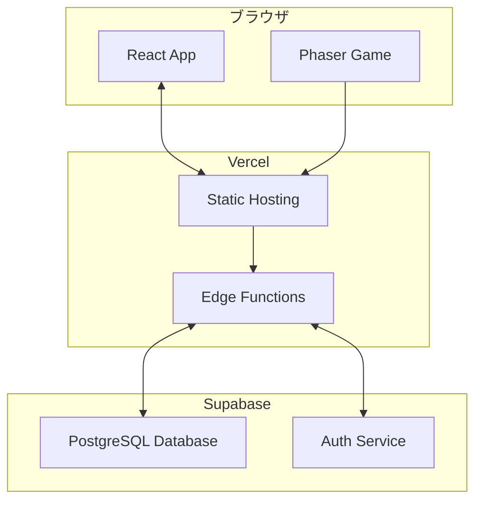

# アーキテクチャ概要

## 技術スタック

### フロントエンド
- **TypeScript**: 型安全な開発言語
- **React**: UIライブラリ
- **Vite**: 高速ビルドツール
- **Phaser**: ゲームエンジン

### バックエンド・インフラ
- **Supabase**: データベース・認証・リアルタイム機能
- **Vercel**: ホスティング・デプロイメント
- **GitHub Actions**: CI/CDパイプライン

### 開発ツール
- **Vitest**: 単体テストフレームワーク
- **Playwright**: E2Eテストフレームワーク
- **ESLint**: コード品質チェック
- **Prettier**: コードフォーマッター

## システム構成


## アプリケーション構造

### ディレクトリ構成
```
src/
├── components/          # 再利用可能なUIコンポーネント
│   ├── ui/             # 基本UIコンポーネント
│   └── game/           # ゲーム固有のコンポーネント
├── scenes/             # Phaserゲームシーン
│   ├── TitleScene.ts   # タイトル画面
│   ├── GameScene.ts    # メインゲーム
│   └── ResultScene.ts  # リザルト画面
├── services/           # ビジネスロジック・API呼び出し
│   ├── gameService.ts  # ゲーム関連の処理
│   └── scoreService.ts # スコア管理
├── types/              # TypeScript型定義
├── utils/              # ユーティリティ関数
└── hooks/              # カスタムReactフック
```

## データフロー

### ゲームプレイフロー
1. **タイトル画面**: React コンポーネントで実装
2. **ゲーム開始**: Phaser シーンに遷移
3. **ゲームプレイ**: Phaser でゲームロジック実行
4. **スコア送信**: Supabase にスコアデータ保存
5. **結果表示**: React コンポーネントで結果表示

### データ管理
- **ローカル状態**: React useState/useReducer
- **グローバル状態**: React Context API
- **永続化**: Supabase Database
- **キャッシュ**: ブラウザ localStorage

## セキュリティ考慮事項

### フロントエンド
- XSS対策: React の自動エスケープ
- CSRF対策: Supabase の組み込み保護
- 入力検証: TypeScript + バリデーションライブラリ

### バックエンド
- 認証: Supabase Auth
- 認可: Row Level Security (RLS)
- データ暗号化: Supabase の標準暗号化

## パフォーマンス最適化

### フロントエンド
- コード分割: Vite の動的インポート
- 画像最適化: WebP形式、適切なサイズ
- バンドル最適化: Tree shaking

### ゲーム
- アセット管理: Phaser のプリロード機能
- メモリ管理: オブジェクトプールパターン
- 描画最適化: スプライトバッチング

## 依存関係

### 主要な依存関係
```json
{
  "react": "^18.x",
  "phaser": "^3.x",
  "@supabase/supabase-js": "^2.x",
  "typescript": "^5.x"
}
```

### 開発依存関係
```json
{
  "vite": "^5.x",
  "vitest": "^1.x",
  "@playwright/test": "^1.x",
  "eslint": "^8.x",
  "prettier": "^3.x"
}
```

## デプロイメント

### CI/CDパイプライン
1. **コミット**: GitHub にプッシュ
2. **テスト**: GitHub Actions でテスト実行
3. **ビルド**: Vite でプロダクションビルド
4. **デプロイ**: Vercel に自動デプロイ

### 環境設定
- **開発環境**: ローカル開発サーバー
- **ステージング**: Vercel プレビューデプロイ
- **本番環境**: Vercel プロダクションデプロイ

## 監視・ログ

- **エラー追跡**: ブラウザ開発者ツール
- **パフォーマンス**: Lighthouse
- **アクセス解析**: Vercel Analytics（プライバシー配慮）